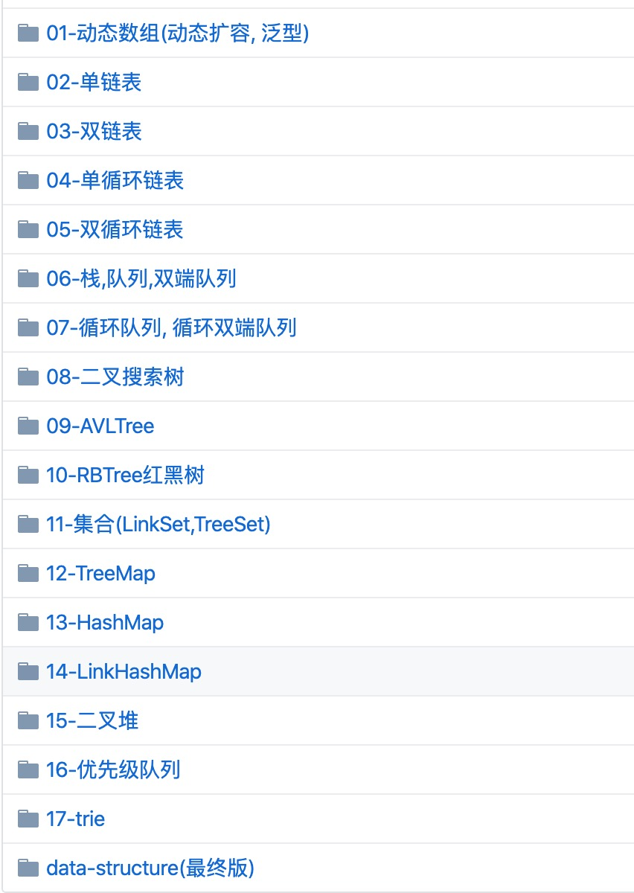

# java-algorithms
java版的数据机构和算法,再此特别感谢小码哥教育机构, 感谢MJ老师, 感谢杰哥把我从数据结构概念层面到升入理解层面

#### 文档说明
data-structure1 是自己一步步实现的过程,记录下来,方便自己以后查看当时的所思所想
data-structure是在data-structure1整理过后的代码, 整体上没有差别

### data-structure目录结构

